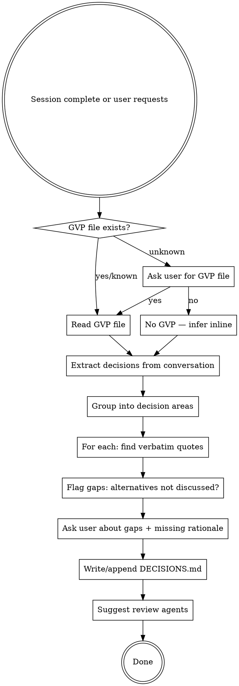

# Decision Tracking (Markdown)

Capture decisions from planning sessions into structured markdown. Produces a DECISIONS.md (or appends a new session section to an existing one). Interim format until GVP YAML tooling is ready.

## When to Use

- End of any brainstorming/planning session (auto-trigger)
- User says "document decisions", "save decisions", "track decisions", "DECISIONS.md"
- After significant design choices were made in conversation
- When user asks to "remember" architectural choices with rationale

**When NOT to use:** Mid-session decision-making (wait until session wraps). Single trivial choices that don't need tracking.

## Process



## Critical Rules

### Rationale MUST be verbatim quotes

Never paraphrase, summarize, or infer rationale. Every rationale field is either:
- A direct quote from the user (with quotation marks)
- `Rationale: TBD` if not discussed

**No exceptions.** If the user said "we want this to be portable and work offline", the rationale is:
> user said, "we want this to be portable and work offline"

NOT: "Portability and offline support were priorities."

### Alternatives tracking

For each decision, document what was considered:
- **Actively discussed** — alternatives that came up in conversation, with rejection rationale (verbatim quotes if available)
- **Claude considered** — alternatives you thought of but the user didn't discuss
- **Human considered** — alternatives the user mentioned but didn't elaborate on

After drafting, **ask the user** about obvious alternatives that weren't discussed:
> I noted these decisions had no alternatives discussed. Were there other options you considered?
> - Decision X
> - Decision Y

### All-rejected decisions

Not every decision has a chosen option. Sometimes all alternatives are explored
and rejected — the group decides not to do something, or to defer entirely. These
are valuable to track because they prevent future sessions from re-treading the
same ground.

Use the `**Status:**` field to distinguish:
- **Accepted** (default, can be omitted) — an option was chosen
- **Rejected** — all options were considered and rejected
- **Deferred** — decision postponed, no option chosen yet

For rejected/deferred decisions, replace `**Chosen:**` with
`**All options rejected because:**` or `**Deferred because:**` with a verbatim
quote (or TBD). The alternatives table still documents what was considered.

### GVP mapping

1. Ask if any GVP files (goals/values/principles) exist for this project, if not already known
2. If yes: read the file and map each decision to specific GVP element IDs (e.g. `project:V3`, `project:P5`)
3. If no: infer goals/values/principles inline and ask clarifying questions where helpful
4. Inferred GVP entries should be clearly marked as inferred for later refinement

## Output Format

### File location

Save to `DECISIONS.md` in the project's docs directory (or project root if no docs dir). If the file already exists, append a new session section — never overwrite previous sessions.

### Structure

```markdown
# [Project Name] — Decisions

---

## Session: YYYY-MM-DD — [Session Description]

**Context:** [What led to this session. What was the state before.
What was being decided and why. 2-4 sentences.]

**GVP source:** `path/to/gvp.yaml` (or "Inferred inline" if no file)

### Inferred Goals/Values (if no GVP file)

> Only include this section if no GVP file was provided.
> Mark all entries as "inferred — refine later".

- **G1: [Goal name]** — [statement]
- **V1: [Value name]** — [statement]
- **P1: [Principle name]** — [statement]

---

### D1: [Decision Name]

> [One-sentence description of the choice]

- **Chosen:** [option selected]
- **Rationale:** user said, "[verbatim quote]"
- **Maps to:** [GVP refs, e.g. project:V3, project:P5]
- **Tags:** [domain/concern tags if applicable]

**Considered:**

| Alternative | Source | Description | Why not? |
|---|---|---|---|
| [Option B] | discussed | [what it is] | user said, "[verbatim quote]" |
| [Option C] | claude considered | [what it is] | [brief reason or "not discussed"] |

---

### D2: [Decision Name] (rejected example)

> [One-sentence description of what was considered]

- **Status:** Rejected
- **All options rejected because:** user said, "[verbatim quote]"
- **Maps to:** [GVP refs]
- **Tags:** [tags]

**Considered:**

| Alternative | Source | Description | Why not? |
|---|---|---|---|
| [Option A] | discussed | [what it is] | user said, "[verbatim quote]" |
| [Option B] | discussed | [what it is] | user said, "[verbatim quote]" |

---

### D3: [Decision Name]

...

---

### Decisions Requiring Rationale

> The following decisions lack verbatim rationale.
> Would you like to provide it?

- **D3: [name]** — [what was decided, no stated reason]
- **D7: [name]** — [what was decided, no stated reason]
```

### Key formatting rules

- Decision IDs are sequential per session (D1, D2, ...) and never reused across sessions
- Rationale always uses `user said, "..."` format with verbatim quotes
- If the user gave rationale across multiple messages, combine the relevant quotes
- "Why not?" column for alternatives: verbatim quote if discussed, "Not discussed" if claude/human considered. Never infer rejection reasons — if the user didn't say why, write "Not discussed"
- Tags use the project's tag vocabulary if a GVP file defines one; otherwise use plain descriptive tags
- Context paragraph should help a future reader understand WHY this session happened

## Post-Finalization Review

After writing/updating DECISIONS.md, **launch two review agents in parallel** to
validate the decisions document. Do not ask — just run them.

### Agent 1: Consistency Review (with context)

Provide this agent with the DECISIONS.md, design doc, and any other relevant
project docs. It should check for:

- **Internal consistency** — do decisions contradict each other?
- **Coherency** — does the rationale for each decision actually support the
  choice made?
- **Gaps** — are there obvious decisions implied by the design that aren't
  tracked? (e.g., a design doc mentions "user accounts" but no decision covers
  auth strategy)
- **GVP alignment** — do the GVP mappings make sense? Are any decisions unmapped
  that should be? Are any mapped that shouldn't be?

### Agent 2: Cold Read (no context)

Provide this agent with **only** the DECISIONS.md — no design doc, no
conversation context, no background. Ask it to:

- Present a reasonably detailed overview of the project based solely on the
  decisions
- Note any inferences it had to make to fill gaps
- Flag anything that seems ambiguous or underspecified

**How to interpret the results:** Anywhere Agent 2 hallucinated, guessed wrong,
or had to infer something that was actually discussed represents a gap in the
documented decisions. These gaps should be addressed by adding or clarifying
decisions.

Present both agents' findings to the user and offer to update DECISIONS.md to
address any issues found.

## Common Mistakes

| Mistake | Fix |
|---|---|
| Paraphrasing rationale | Always verbatim quotes or TBD. No exceptions. |
| Skipping alternatives | Every decision has alternatives, even if only "claude considered" |
| Vague GVP mapping ("flexibility", "usability") | Map to specific IDs (project:V3) or mark as inferred with a concrete statement |
| No session context | Always include what led to the session and what state the project was in |
| Overwriting previous sessions | Append new session section. Never modify previous sessions. |
| Not asking about gaps | After drafting, explicitly ask about undiscussed alternatives and missing rationale |
| Inferring rejection reasons | "Why not?" must be a verbatim quote or "Not discussed". Never write "implied conflict with..." or "contradicts user's intent" |
| Redundant rationale format | Write `**Rationale:** TBD` not `**Rationale:** Rationale: TBD` |
| Missing status on rejected/deferred decisions | Always include `**Status:** Rejected` or `**Status:** Deferred` when no option was chosen. Accepted is the default and can be omitted. |
| All-rejected decisions lost | If the group explored something and decided against all options, that's still a decision worth tracking — it prevents future re-treading |
| Skipping review agents | After finalization, launch the two review agents automatically. They catch real gaps. |
